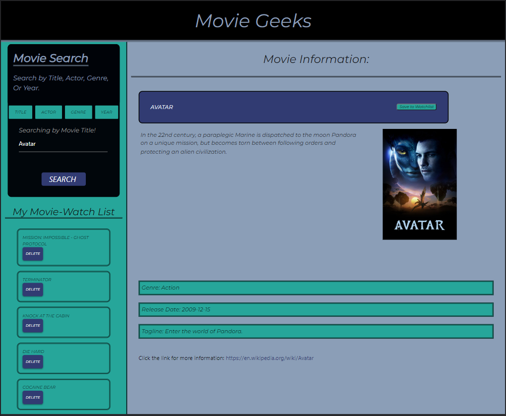

# Movie Geeks

## Description:
A web application for users to search for and compile a list of movies with the ability to use several different search options.

The team created this project to make compiling a list of movies someone wants to watch while also giving them more information about the movie. The movie list is sortable so it can be arranged in the order someone may want to watch them.

Our motivation for creating this application was the desire to create a UI that was practical and easy to use.

We built this project to fill a simple need. People are always trying to remember the names of movies they want to see. This allows them to keep it on a handy list.

The application solves the problem of not trying to remember the names of movies you want to see. You can easily add them to the list and refer to it at any time.

We learned about API's, making an application that is clean, functional, yet simple to use, and also collaborating as a team to achieve a result that the end user can enjoy.

## Assets:

## The URL of the Deployed Application:

https://shannonkprice00.github.io/movie-watchlist/

## The URL of the GitHub Repository:

https://github.com/shannonkprice00/movie-watchlist

## Credits
Tutorials Followed: 
[Sortable Method](https://stackoverflow.com/questions/60592825/sortablejs-isnt-saving-my-sorted-todo-list-in-localstorage) 
[Removing Event Listeners](https://developer.mozilla.org/en-US/docs/Web/API/EventTarget/removeEventListener) 
Collaborators: 
Jerrick Johnson 
Billy Scoggins 
Josue Lopez 
Shannon Price 